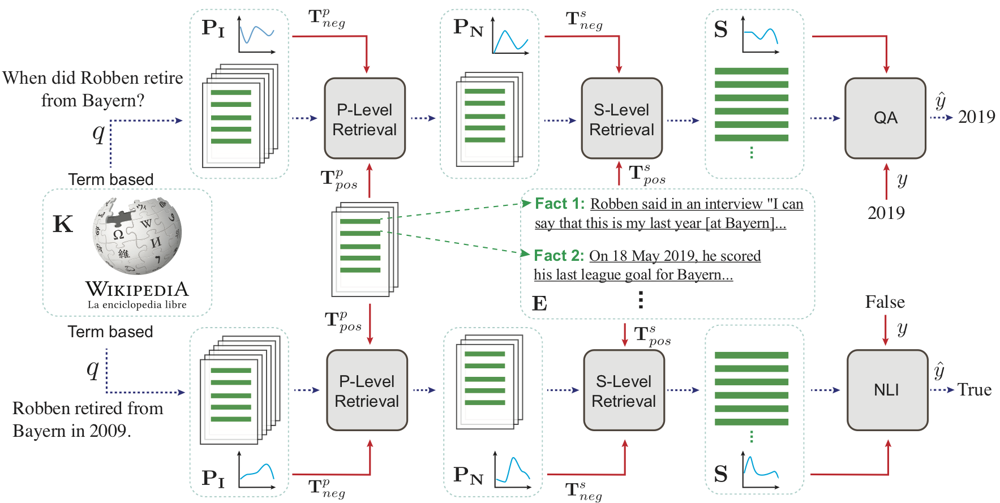

# semanticRetrievalMRS
This repo contains the source code for the following paper 
* Yixin Nie, Songhe Wang, Mohit Bansal, *Revealing the Importance of Semantic Retrievalfor Machine Reading at Scale.* in EMNLP, 2019.". ([arxiv](http://arxiv.org/abs/1909.08041))

## Introduction
The paper proposes a simple but effective pipeline system for both Question Answering and Fact Verification, achieving start-of-the-art results on [HotpotQA](https://hotpotqa.github.io) and FEVER 1.0.

The system roughly consists of 4 components (see the figure below): Term-based/Heuristic Retrieval, Neural Paragraph Retrieval, Neural Sentence Retrieval and QA/NLI.

Each neural component is trained by sampling data using upstream components and supervised by intermediate annotations provided by the data set. (Find out more in the paper.)




**More importantly**, the system is used as a testbed to analyze and reveal the importance of intermediate semantic retrieval and how the retrieval performance will affect the downstream tasks on different metrics.
We hope the analysis could be insightful and inspiring for future development on OpenDomain QA/NLI systems. 
## Results

## Requirement
* Python 3.6
* torch 1.0.1.post2
* allennlp 0.8.1
* pytorch-pretrained-bert 0.4.0
* tqdm
* sqlitedict
* lxml
* (More coming)

Download spacy em-package after installing allennlp.
```
python -m spacy download en_core_web_sm
```

Packages with different versions might be compatible but are not tested.

## Preparation
#### Download Data
##### Dataset
In the repo directory, run the following commands. 
```bash
mkdir data
cd data
mkdir hotpotqa
cd hotpotqa
wget http://curtis.ml.cmu.edu/datasets/hotpot/hotpot_train_v1.1.json
wget http://curtis.ml.cmu.edu/datasets/hotpot/hotpot_dev_distractor_v1.json
wget http://curtis.ml.cmu.edu/datasets/hotpot/hotpot_dev_fullwiki_v1.json
wget http://curtis.ml.cmu.edu/datasets/hotpot/hotpot_test_fullwiki_v1.json
```
##### Wikipedia (Optional)
In the repo directory, run the following commands. 
```bash
cd data
wget https://nlp.stanford.edu/projects/hotpotqa/enwiki-20171001-pages-meta-current-withlinks-processed.tar.bz2
wget https://nlp.stanford.edu/projects/hotpotqa/enwiki-20171001-pages-meta-current-withlinks-abstracts.tar.bz2
```

##### Preprocessed Wiki
We preprocessed the Wikipedia dump and saved it into a sqlite-database.
The database can be downloaded from [whole_for_rindex.db](https://drive.google.com/file/d/10sekXDgoFUN42fOCL3Lpcn47Jc7cJ8y-/view?usp=sharing).

In the repo root directory, create the folder for the processed wikidb:
```
mkdir -p data/processed/reverse_indexing
```
Then, move the downloaded db-file into the above folder `data/processed/reverse_indexing/whole_for_rindex.db`.

#### Intermediate Retrieval Data
We also provide intermediate retrieval data that you can directly use for any downstream.

##### HotpotQA
Download the intermediate paragraph and sentence level results using the command below.
```
bash scripts/intermediate_retri_hotpot.sh
```
##### FEVER
(Coming)

#### Folder Structure
In order to run further experiments, your repository folder should be similar to the one below.
```bash
.
├── data
│   ├── hotpotqa
│   │   ├── hotpot_dev_distractor_v1.json
│   │   ├── hotpot_dev_fullwiki_v1.json
│   │   ├── hotpot_test_fullwiki_v1.json
│   │   └── hotpot_train_v1.1.json
│   ├── p_hotpotqa
│   │   ├── hotpotqa_paragraph_level
│   │   ├── hotpotqa_qa_results
│   │   └── hotpotqa_sentence_level
│   └── processed
│       └── reverse_indexing
│           └── whole_for_rindex.db
├── ENV
├── LICENSE
├── README.md
├── scripts
│   └── intermediate_retri_hotpot.sh
├── setup.sh
└── src
    ├── bert_model_variances
    ├── build_rindex
    ├── config.py
    ├── data_utils
    ├── evaluation
    ├── fever_doc_retri
    ├── fever_eval
    ├── fever_models
    ├── fever_sampler
    ├── fever_utils
    ├── flint
    ├── hotpot_content_selection
    ├── hotpot_data_analysis
    ├── hotpot_doc_retri
    ├── hotpot_eval
    ├── hotpot_fact_selection_sampler
    ├── inspect_wikidump
    ├── multi_task_retrieval
    ├── neural_modules
    ├── open_domain_sampler
    ├── qa_models
    ├── span_prediction_task_utils
    ├── squad_models
    ├── utils
    └── wiki_util
```

## Training
##### Train final HotpotQA Model
Now, you can run the following command in the repo root directory to train a QA model on HotpotQA data:
```
source setup.sh
python src/qa_models/hotpot_bert_v0.py
```

The model checkpoints will be saved in `saved_models` directory.

Note: You can ignore the potential error prompts.


## Citation
```bash
@inproceedings{ynie2019revealing,
  title     = {Revealing the Importance of Semantic Retrieval for Machine Reading at Scale},
  author    = {Yixin Nie, Songhe Wang, Mohit Bansal},
  booktitle={2019 Conference on Empirical Methods in Natural Language Processing and 9th International Joint Conference on Natural Language Processing ({EMNLP-IJCNLP})},
  year      = {2019}
}
```
